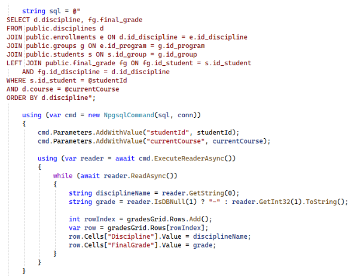

# Прототип системы для ведения рабочих ведомостей по дисциплинам
Данный проект является курсовой работой на тему "Разработка серверной части прототипа системы для введения рабочих ведомостей по дисциплинам".

## Введение
В современном образовательном процессе особое внимание уделяется автоматизации управленческих и информационных процессов, что способствует повышению качества образовательных услуг и упрощению административных процедур. Одной из таких задач является ведение рабочих ведомостей по дисциплинам, которое на сегодняшний день в НИУ ВШЭ осуществляется вручную, с использованием различных форматов и методов коммуникации.  

Актуальность разработки серверной части прототипа системы для ведения рабочих ведомостей обусловлена необходимостью интеграции разрозненных процессов в единое информационное пространство. На основе анализа результатов опросов преподавателей и студентов, проведённых для выявления основных проблем и потребностей, можно сделать вывод о том, что внедрение автоматизированной системы позволит: 
- автоматизировать процесс заполнения рабочих ведомостей преподавателями и сократить временные затраты на их отправку студентам; 
- обеспечить оперативное и удобное информирование студентов о выставленных оценках; 
- предоставить сотрудникам учебного офиса инструменты для анализа успеваемости и посещаемости, а также своевременного выявления случаев неудовлетворительной успеваемости. 

Проблема проекта: отсутствие единой автоматизированной системы, способной заменить разрозненные методы ведения рабочих ведомостей, что приводит к дублированию усилий, неэффективному использованию времени и повышению вероятности ошибок в документообороте. 

Актуальность проекта: тенденция к цифровизации образовательных процессов, которая позволяет повысить прозрачность и качество образовательного процесса, а также снизить нагрузку на педагогический состав. 

Цель курсовой работы: разработать серверную часть прототипа системы для автоматизации ведения рабочих ведомостей по дисциплинам, которая обеспечит единообразное заполнение, хранение и доступ к информации о посещаемости и оценках студентов. 

## Анализ
### Анализ существующих решений
Системы управления обучением (LMS) предлагают богатый функционал и гибкость, однако могут быть избыточными для узкой задачи ведения рабочих ведомостей. Корпоративные ERP-системы обеспечивают высокую надежность и интеграцию с другими процессами, но требуют значительных ресурсов для внедрения. Специализированные решения и облачные платформы позволяют создать более адаптированное и экономичное решение, однако сопряжены с рисками масштабирования и безопасности данных.  

Исходя из преимуществ и недостатков существующих решений можно прийти к умозаключению, что выбор платформы для ведения ведомостей должен основываться на специфике образовательного учреждения, масштабах работы и требуемом функционале.  

Поскольку в рамках поставленной задачи реализация прототипа системы для ведения рабочих ведомостей должна осуществляться для конкретного учебного заведения, то стоит отдать предпочтение быстрому и удобному решению, адаптированному под конкретные нужды организации. Тем не менее, предстоит работа с большим количеством персональных данных, в связи с чем было принято решение о разработке прототипа специализированной системы для ведения рабочих ведомостей под конкретное высшее учебное заведение.  

### Анализ и постановка функциональных требований
Для проведения полного анализа требований были отдельно рассмотрены нужды и пожелания по функциональному наполнению системы для каждой группы пользователей (студенты, преподаватели, сотрудники учебного офиса). 

После проведения анализа функциональных требований для роли «Преподаватель» были выявлены следующие требования: 
- преподаватель должен иметь возможность просмотра дисциплин, которые он ведет; 
- преподаватель должен иметь возможность осуществлять выбор группы для просмотра и заполнения рабочей ведомости; 
- преподаватель должен иметь возможность вносить и корректировать формулу оценивания (конкретизировать список элементов контроля) для каждой дисциплины; 
- преподаватель должен иметь возможность заполнения рабочих ведомостей по дисциплинам, а также отслеживания и отметки посещаемости; 
- итоговые оценки за дисциплину выставляются автоматически согласно установленной формуле оценивания; 
- заполненные ведомости автоматически становятся доступны для просмотра студентам и сотрудникам учебного офиса; 
- преподаватель должен иметь возможность экспорта заполненной в системе ведомости в формате «.xlsx».

Аналогичные списки требований были составлены для групп пользователей "Студент" и "Сотрудник учебного офиса".

### Среда разработки
Для разработки прототипа системы были выбраны язык программирования С# и среда разработки Visual Studio с использованием интерфейса программирования Windows Forms, поскольку эта технология подходит для быстрого создания прототипа с графическим интерфейсом для оценки концепции приложения и тестирования основных функций на ранней стадии. Для реализации базы данных для системы была выбрана СУБД PostgreSQL

## Проектирование
### База данных
Для реализации серверной части прототипа системы ведения рабочих ведомостей по дисциплинам спроектировать базу данных, которая эффективно хранит и управляет данными, минимизирует избыточность и обеспечивает целостность данных.  Проектирование базы данных осуществлялось в несколько этапов, каждый из которых направлен на улучшение структуры и соответствие нормальным формам.  

Исходя из определенных ранее требований к системе, были выделены 13 сущностей. Ниже представлена ER-диаграмма базы данных:

На данной схеме можно заметить реализацию связей «один ко многим» (например, отношения таблиц Groups и Students) и связей «многие ко многим» с использованием дополнительных таблиц (например связь таблиц Disciplines и Programs с помощью таблицы Enrollments), которые способствуют нормализации базы данных. 

Итоговая схема базы данных соответствует третьей нормальной форме. Каждая таблица имеет первичный ключ, и все неключевые атрибуты зависят только от первичного ключа и не имеют транзитивных зависимостей.

### Архитектура системы
Для того, чтобы спроектировать архитектуру системы было принято решение построить диаграммы последовательностей для каждой роли. Данные диаграммы наглядно продемонстрируют порядок и механизмы взаимодействия элементов системы. 

На рисунке ниже представлена диаграмма последовательности для роли «Преподаватель»: 

На данной диаграмме изображены все ключевые взаимодействия с системой со стороны группы пользователей «Преподаватели», а именно авторизация в системе, переход к ведомости выбранной группы и ее редактирование, а также отметка посещаемости. 

Также была построена диаграмма компонентов. Это необходимо для того, чтобы визуализировать архитектуру системы и ее разбиение на функциональные модули.

На диаграмме представлены основные модули разрабатываемой системы и их взаимодействие с внешними системами: СУБД PostgreSQL и программой для работы с электронными таблицами Microsoft Excel. Были выделены следующие основные модули прототипа системы: 
- модуль аутентификации; 
- модуль управления данными; 
- преподавательский модуль; 
- модуль учебного офиса; 
- студенческий модуль; 
- модуль работы с данными. 

Таким образом, с помощью диаграммы компонентов были определены основные модули разрабатываемой системы. 

## Реализация
База данных для прототипа системы ведения рабочих ведомостей по дисциплинам была реализована в ранее выбранной системе управления базами данных PostgreSQL. Реализованная база данных состоит из 13 таблиц, описанных ранее при проектировании.

В программном коде были реализованы различные SQL-запросы к базе данных для извлечения или внесения данных. На следующем рисунке продемонстрирован запрос для получения данных из базы: 

Данный запрос реализует получение информации об итоговых оценках студента по дисциплине с дальнейшим добавлением этой информации в таблицу для просмотра этих оценок в системе. 

На следующем рисунке продемонстрирован SQL-запрос для добавления данных о контрольных элементах по дисциплине в таблицу базы данных «control_element»: 

В программном коде прототипа системы реализовано 19 классов.

## Тестирование
Для тестирования прототипа системы для ведения рабочих ведомостей по дисциплинам был использован метод "черного ящика". Тестирование проводилось на основе входных данных и ожидаемых выходных результатов отдельно для каждого функционального модуля.  

Основная цель тестирования – убедиться, что система правильно выполняет все функциональные требования. Метод "черного ящика" отлично подходит для этой цели, так как позволяет проверить правильность работы интерфейса, корректность бизнес-логики и работу обработки ошибок. 

Во время тестирования всех модулей ошибок в прототипе системы для ведения рабочих ведомостей выявлено не было. 

## Заключение
В ходе выполнения курсовой работы «Разработка серверной части прототипа для ведения рабочих ведомостей по дисциплинам» была проведена работа, направленная на создание и тестирование ключевых функциональных модулей прототипа. 

Проведён анализ существующих систем для ведения рабочих ведомостей и выявлены их преимущества и недостатки. На основании проведённого исследования (в том числе изучения LMS-систем, корпоративных ERP-решений, локальных разработок и облачных сервисов) было определено, что оптимальный вариант для данного прототипа — реализация специализированной системы, учитывающей особенности работы преподавателей и студентов в НИУ ВШЭ. 

Результаты проведенных опросов преподавателей и студентов позволили сформировать функциональные требования к разрабатываемому прототипу.  

Проектирование архитектуры базы данных осуществлялось с учётом необходимости хранения большого количества связанных данных об оценках, посещаемости, пересдачах и отчётах. В результате была создана структура, отражающая взаимосвязь между студентами, преподавателями, дисциплинами и группами, обеспечивающая целостность и удобство масштабирования. 

Проектирование архитектуры серверной части осуществлялось с использованием диаграмм последовательности для каждой группы пользователей, а также построением диаграммы компонентов. 

Реализация базы данных в СУБД включала создание 13 таблиц и различных типов связей между ними, а также написанием SQL-запросов для работы с оценками, посещаемостью и другими данными. 

Реализация основных функциональных модулей позволила создать работоспособный прототип, отвечающий основным потребностям преподавателей, студентов и сотрудников учебного офиса. При разработке особое внимание уделялось корректности обработки данных. 

Тестирование серверной части проводилось методом «чёрного ящика», что позволило оценить корректность работы с точки зрения пользователя. 

Перспективы дальнейшего развития системы заключаются в расширении функционала и интеграции прототипа с другими информационными ресурсами НИУ ВШЭ, такими как системы управления расписанием, библиотечные сервисы и т.д. Кроме того, возможна реализация дополнительных модулей для автоматической отправки уведомлений студентам и преподавателям, интеграция с мобильными приложениями, а также углублённая аналитика успеваемости на базе современных методов обработки данных. 

